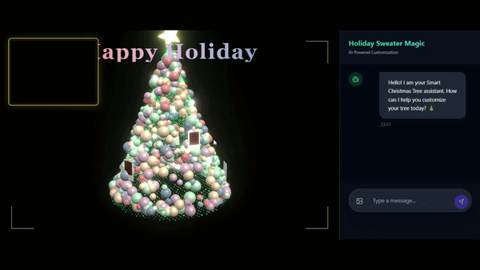
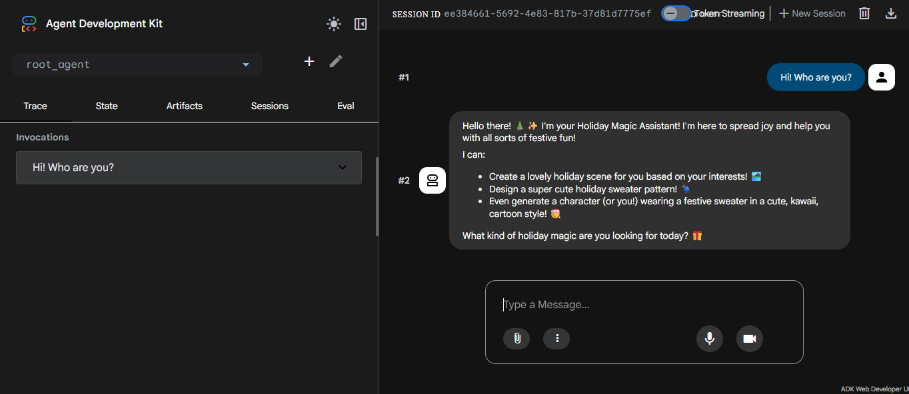
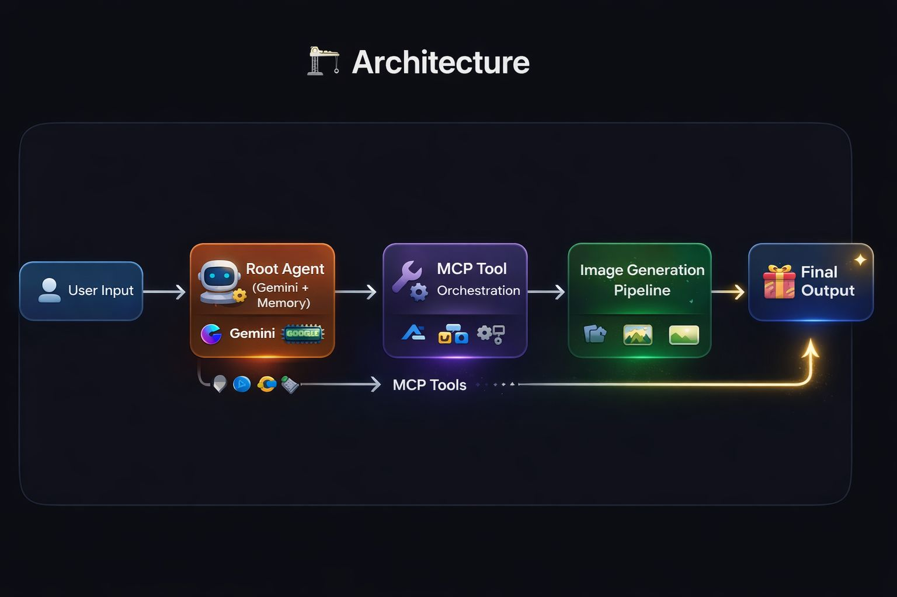

# 🎄 Holiday AI Agent  
### Context-Aware Multi-Agent System (ADK + MCP + Gemini)

An AI agent that doesn’t just respond — it creates interactive experiences.

🚀 This project demonstrates a context-aware AI agent built with Google ADK, MCP (Model Context Protocol), and Gemini — now enhanced and deployed as a live, interactive application.

⸻

🌐 Live Demo

👉 https://holiday-app-194383643137.us-central1.run.app/

## 🎥 Demo Video  

👉 Coming soon...

## 🎥 Demo Preview



⸻

## 🖇️ How it works

1. User input is processed by the agent
2. ADK orchestrates reasoning and tool usage
3. MCP connects external tools
4. Memory system personalizes responses

⸻

🧠 What’s new (Update)

Originally built as a simple codelab, this project has evolved into a more advanced AI system:

* 🚀 From static demo → live deployed application
* 🧠 From simple responses → memory-enabled interactions
* 🎨 From basic UI → interactive 3D experience
* ⚡ From isolated logic → full AI agent architecture

⸻

🖼️ Live Demo Preview

🤖 AI Interaction

The agent understands context and provides real-time personalized responses through an interactive chat interface.

⸻

✨ Features

* 🤖 AI Agent with memory (context-aware interactions)
* 🧠 MCP (Model Context Protocol) integration
* 🎨 Interactive 3D UI (React + Three.js)
* ⚡ Real-time responses (Gemini)
* ☁️ Deployed on Google Cloud Run
* 🔄 Full-stack AI system

⸻

🛠️ Tech Stack

* Google ADK
* MCP (Model Context Protocol)
* Gemini (LLM)
* Python (Backend)
* React + Three.js (Frontend)
* Google Cloud Run

⸻

🧩 Architecture

* Agent Layer → reasoning & decision making
* Memory Layer → context retention
* MCP Layer → tool orchestration
* Frontend → interactive 3D UI
* Backend → AI logic & API

⸻

📂 Project Structure

* backend/ → AI agent & API
* frontend/ → React + 3D UI
* static/ → generated outputs & visuals

⸻

💡 What I Learned

* Building AI agents with memory
* Structuring agent-based systems
* Integrating LLMs with UI
* Deploying full-stack AI applications
* Combining AI with interactive 3D experiences

⸻

🔮 Future Improvements

* Multi-agent workflows
* Voice interaction
* Enhanced personalization
* More advanced UI animations

⸻

## Before the upgrate

This project demonstrates a context-aware AI agent built using Google ADK, MCP (Model Context Protocol), and Gemini 2.5 Flash, capable of orchestrating multiple tools and steps to complete complex tasks autonomously.

### 🎄 Holiday Scene


### 👕 Sweater Pattern


### 🤖 Web UI


⸻

## ✨ Overview

Instead of a basic chatbot, this AI agent:

- Understands context with a defined persona
- Uses tools via MCP to perform actions
- Generates visual outputs through multi-step workflows

⸻

## 🎯 Capabilities

The agent can generate:

- 🎄 Holiday scenes  
- 🧶 Sweater patterns  
- 👕 Characters wearing custom designs  
- 🖼️ Final composed images  

⸻

## 🔁 Example Workflow

User prompt:

"Create a snowy holiday scene and design a pizza-themed sweater"

Agent execution:

1️⃣ Generate holiday scene  
2️⃣ Create sweater pattern  
3️⃣ Generate character wearing it  
4️⃣ Compose final image  

➡️ All steps are executed automatically via MCP tools.

⸻

## 🏗️ Architecture

This diagram shows how the agent orchestrates multiple tools to generate the final output.



⸻

## 🧠 What Makes This Project Interesting

Instead of just calling a model, this project demonstrates:

- Context-aware behavior using memory  
- Tool usage via MCP  
- Iterative agent development  
- Real-time testing with a web UI  

👉 This reflects how modern AI systems move beyond prompts and become **structured, functional agents**.

⸻

## 🛠️ Tech Stack

- Python  
- Google ADK (Agent Development Kit)  
- MCP (Model Context Protocol)  
- Gemini 2.5 Flash  
- FastAPI / Uvicorn  

⸻

## 🚀 Getting Started

```bash
git clone https://github.com/beyzauzun-ai/holiday-ai-agent-adk.git
cd holiday-ai-agent-adk
pip install -r requirements.txt
```

⸻

### 🔑 Set your API key:

export GOOGLE_API_KEY=your_api_key_here

⸻

### ▶️ Run the agent:

python main.py

⸻

### 👩‍💻 Author

Beyza Uzun

AI & Data Enthusiast
